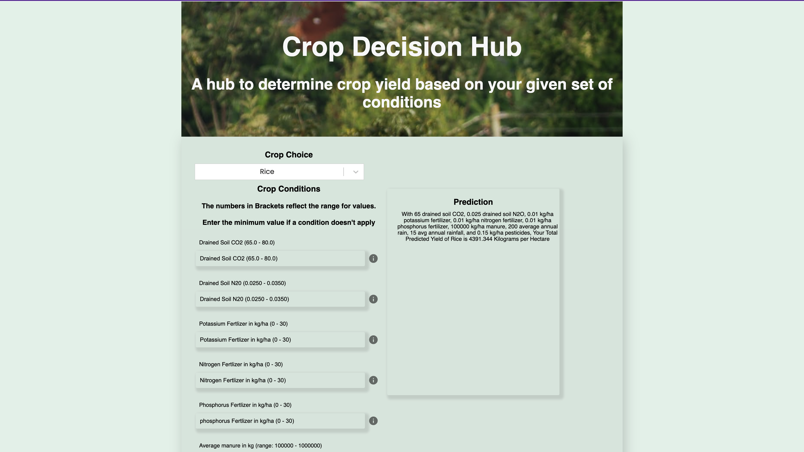
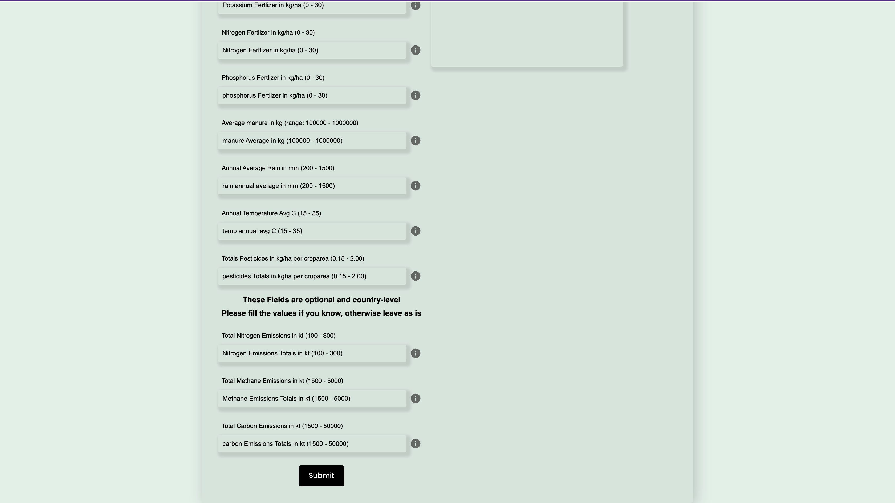

# About Crop Decision Hub

## Overview
This is a React and FASTAPI app that:
1. Provides the predicted annual yield and summary of conditions for a selected crop give the type of soil they applied manure to. In the prediction interface, the user enters values for a few conditions necessary for the growth of the selected crop and they get a predicition of what is the anticipated yield given the conditions. The form input labels specify the min and max values as well as the units of the various conditions. I use FASTAPI to load pickeled models that generate prediction based on form data sent from the frontend. The API then sends the prediction back to the frontend and displays the result in text format
2. Allows users to create an account and log in to access the prediction interface. In the current version, I haven’t implemented signing up and will do so in the next iteration. 

## How to run the app locally

1. Navigate to a desired project directory and clone the repository: https://github.com/SNWambui/Capstone_Projects/tree/main/crop_decision
2. Navigate to the frontend directory and run: npm start.  This will run on localhost:3000 will display the sign up page.
3. Before signing up, navigate into the backend api folder: `cd backend/api`.
4. Create a virtualenv `python3 -m virtualenv env`
5. Activate virtualenv `source env/bin/activate`
6. Install the required packages `python -m pip install -r requirements.txt`
7. Start the app using Uvicorn `uvicorn app.main:app --reload --workers 1 --host 0.0.0.0 --port 8080`
8. Login in localhost:3000/login and enter the crop conditions.

Here is a screenshot of what the web app should look like 

## Release Notes
