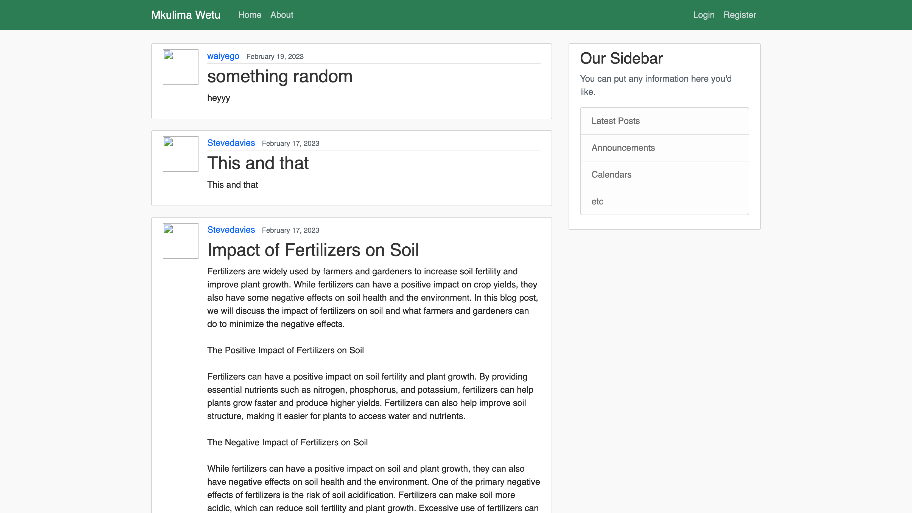
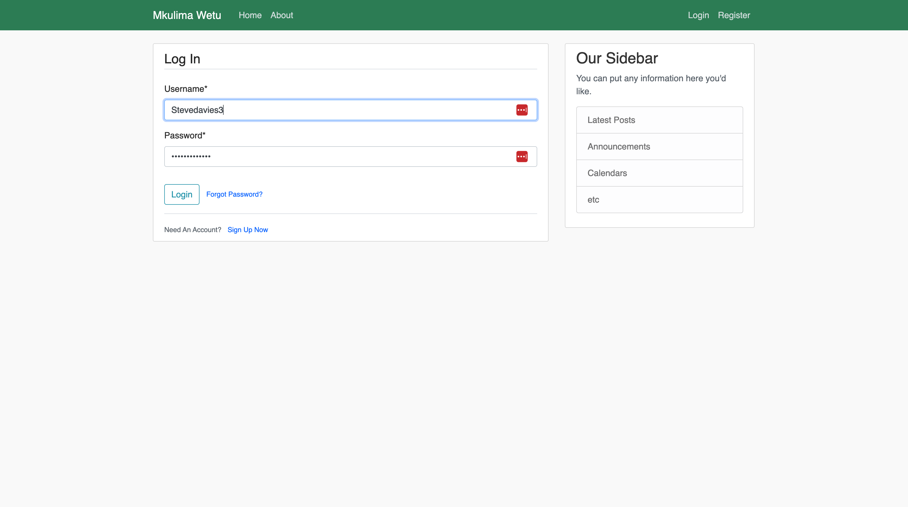
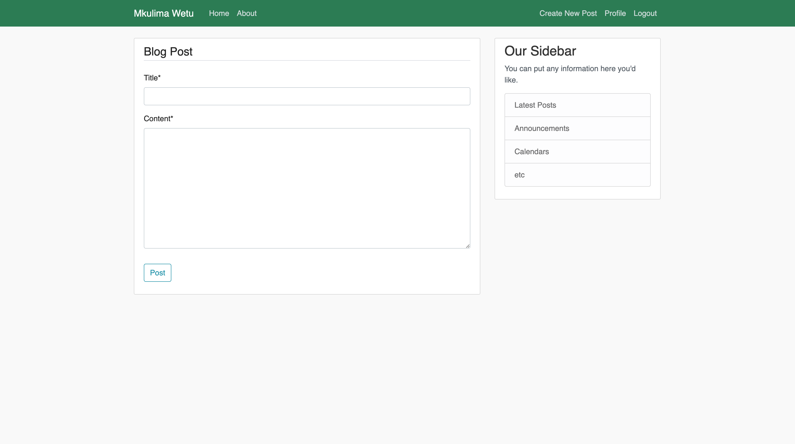
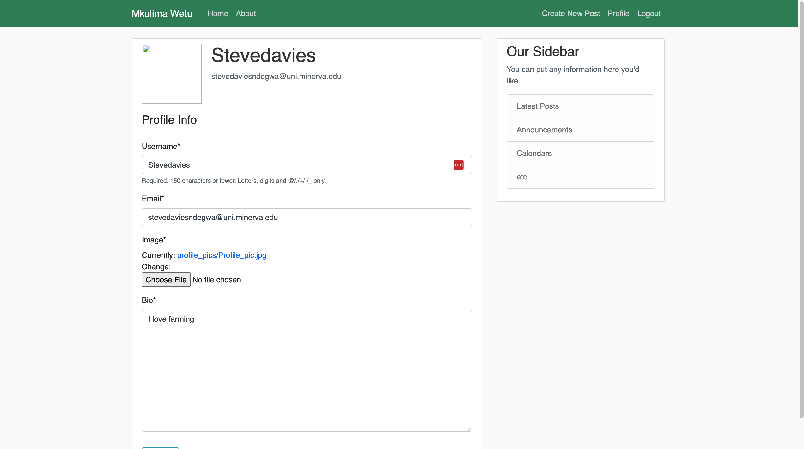

# About Mkulima Project (Blogging App)

## Overview
Mkulima Project is a django app that 
1. Allows users to create an account, log in and create a profile. Logged in users are able to create blog posts, update them and delete them. The goal of this is so that only users with accounts can create blog posts but anyone can see all posts. 
2. Allows users to read blogs from other farmers and share their own blogs to farmers. The goal of this to allow users to have a place the can share information easily and store general information related to farming.

## How to run the app locally
Navigate to a desired project directory and clone the repository: 
`git clone https://github.com/SNWambui/Capstone_Projects/tree/main/mkulima_project`

Create a virtual environment: 
`python3 -m venv django`
`source django/bin/activate`

All the requirements for the project are stored in the requirements.txt file. To install them run: 
`pip3 install -r requirements.txt`

Create an .env file in the root directory and store anything that was gotten from this project's .env file. Generate and store you new secret key and database credentials. You can use `Djecrety` to generate a secure secret key. It's good practice to create a .env file to store sensitive information and then add this file to a .gitignore file so that the info is not uploaded to github.

Make migrations from scratch. Note that you will generate a local sqlite database but can choose to connect a local postgreSQL database. 
`$ python manage.py makemigrations`
`$ python manage.py migrate`

Create a new superuser: 
`python manage.py runserver`

Start the development and check that there are no errors: 
`python manage.py runserver`

Here is a screenshot of what the web app should look like for a logged out user

Here is a screenshot of the log in interface

Here is a screenshot of the blog creation page for a logged in user

Here is a screenshot of the profile page for a logged in user
