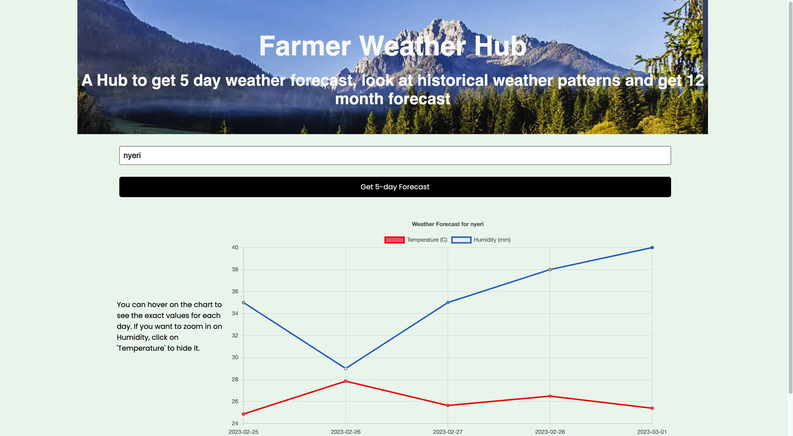
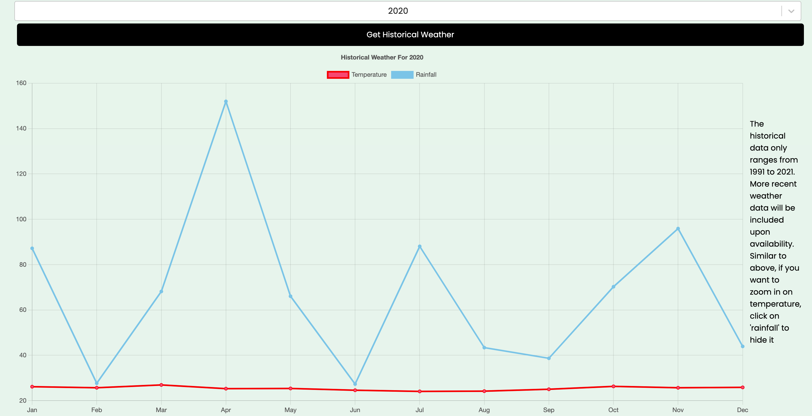
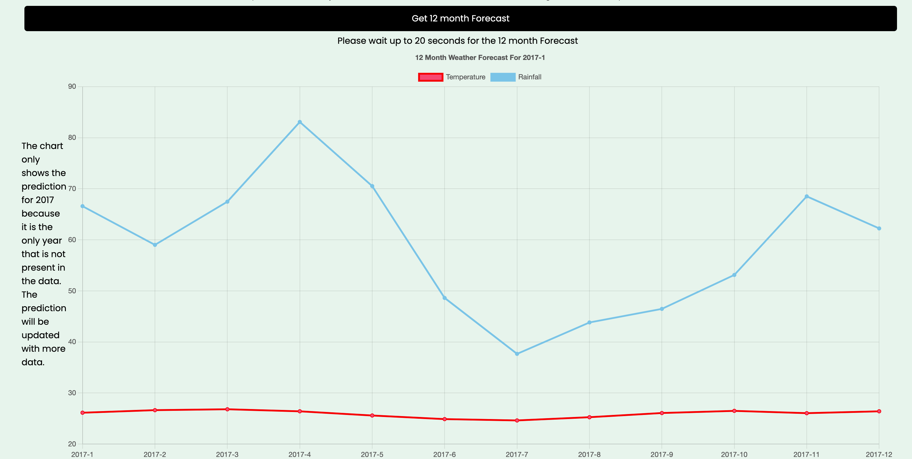

# About Weather Prediction

## Overview
This is a Django and react app that:
1. Displays a 5 day temperature and humidity forecast for a given city a user enters. This forecast is generated by calling the OpenWeatherMap API. 
2. Displays historical monthly average temperature and rainfall data for Kenya between 1991 and 2021. The user has the option to select a given year but the default year is 2021. Ideally, it should display the monthly averages per given year for the city the user enters. However, showing historical data for more than 16 days from an API requires a paid subscription to an API. Therefore this implementation is a proof of concept of the functionality that is based on downloading data as a csv and loading it locally. The csv file is in the data_sources folder under the path './frontend/src/components/data_sources'
3. Displays a 12 month forecast based on data from the past 30 years for a given city. Just as with the historical data, the 12 month prediction will be for Kenya instead of the city because of the issue with getting historical data. This implementation is what necessitates the use of Django to run the machine learning models, and use the Django-REST-API to return the predictions to the react frontend.

## How to run the app locally
The display of the 5-day forecast and the historical monthly average does not require a backend since it's data from an API. Therefore to run this:
1. Navigate to a desired project directory and clone the repository: 
`git clone https://github.com/SNWambui/Capstone_Projects/tree/main/weather_prediction/frontend`

2. Navigate to the frontend directory and run:
`npm start` 
This will run on localhost:3000

Note that unlike with Django, React conveniently has all the installed packages in the packages.json. Therefore, all you need to do is clone the repository and run it and you are good to go. 

To display all three, you will need to run the Django backend since the API call to return the predictions for displaying 6 month forecast is dependent on the backend running. Conveniently, I found [this](https://fractalideas.com/blog/making-react-and-django-play-well-together-hybrid-app-model/#fnref:7) article which describes how to connect a React frontend and Django backend so that you will only need to be in the Django environment for everything to work. The app has already been configured so that every react change is captured in the backend.

1. Navigate to a desired project directory and clone the repository: 
`git clone https://github.com/SNWambui/Capstone_Projects/tree/main/weather_prediction`

2. Create a virtual environment: 
`python3 -m venv django`
`source django/bin/activate`

3. Navigate to the backend folder:
`$cd backend`

4. All the requirements for the project are stored in the requirements.txt file. To install them run: 
`pip3 install -r requirements.txt`

5. Create an .env file in the root directory and store anything that was gotten from this project's .env file. Generate and store you new secret key and database credentials. You can use `Djecrety` to generate a secure secret key. It's good practice to create a .env file to store sensitive information and then add this file to a .gitignore file so that the info is not uploaded to github.

6. Make migrations from scratch. Note that you will generate a local sqlite database but can choose to connect a local postgreSQL database. 
`$ python manage.py makemigrations`
`$ python manage.py migrate`

7. Create a new superuser: 
`python manage.py runserver`

8. Start the development and check that there are no errors: 
`python manage.py runserver` 
This will run on localhost:8000

Here is a screenshot of what the web app should look like after a city has been entered

## Release Notes
